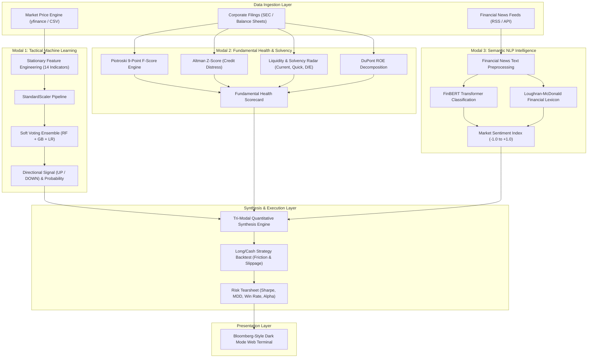
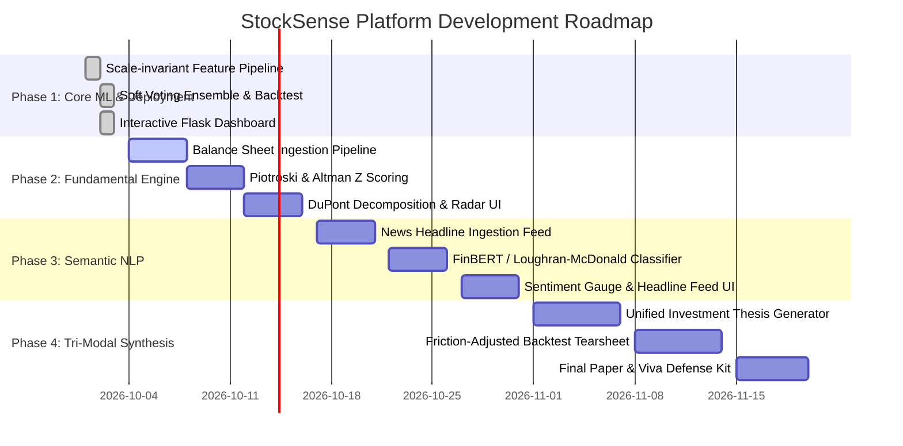

# StockSense: Quantitative Machine Learning & Tri-Modal Investment Platform
## System Architecture & Technical Specification Document

---

## 1. Executive Vision & Abstract

**StockSense** is an institutional-grade quantitative machine learning platform engineered to address the complexities of financial time-series forecasting. While conventional financial machine learning projects rely solely on noisy price sequences (often falling victim to lag-1 persistence illusions), StockSense implements a **Tri-Modal Architecture** that fuses three distinct data representations:

1. **Microstructure & Tactical Price Momentum (Numerical Time-Series):** Stationary technical features modeled through a regularized soft-voting classifier ensemble.
2. **Corporate Financial Health & Solvency (Accounting Fundamentals):** Balance sheet and income statement analysis leveraging the Piotroski 9-Point F-Score, Altman Z-Score, and DuPont ROE decomposition.
3. **Market Sentiment & Executive Tone (Semantic NLP):** Real-time financial headline sentiment classification using FinBERT and the Loughran-McDonald financial lexicon.

Together, these three intelligence streams feed a **Quantitative Alpha Backtesting Engine** that measures risk-adjusted economic performance (Sharpe, Drawdown, Win Rate) against passive market benchmarks.

---

## 2. High-Level System Architecture



---

## 3. Mathematical & Algorithmic Formulations

### 3.1 Modal 1: Tactical Machine Learning Engine

#### Stationarity & Feature Transformation
Raw prices ($C_t$) exhibit unit roots and non-stationarity. StockSense converts all market features into scale-invariant stationary metrics:

* **Instantaneous Log Return:**
  $$R_t = \ln\left(\frac{C_t}{C_{t-1}}\right) \approx \frac{C_t - C_{t-1}}{C_{t-1}}$$
* **Relative Moving Average Distance:**
  $$\text{MA\_Ratio}_{k}(t) = \frac{C_t - \text{SMA}_k(C_t)}{\text{SMA}_k(C_t)}$$
* **Normalized MACD:**
  $$\text{MACD\_Norm}_t = \frac{\text{EMA}_{12}(C_t) - \text{EMA}_{26}(C_t)}{C_t}$$
* **Bounded Bollinger Position:**
  $$\text{BB\_Position}_t = \frac{C_t - \text{Lower}_t}{\text{Upper}_t - \text{Lower}_t} \in [0, 1]$$

#### Soft Voting Probability Aggregation
$$\hat{P}(y_{t+1}=1 \mid \mathbf{x}_t) = \sum_{m=1}^{M} w_m P_m(y_{t+1}=1 \mid \mathbf{x}_t)$$
Where $w_m = \frac{1}{3}$ across Logistic Regression ($L_2$ shrinkage), Random Forest, and Gradient Boosting.

---

### 3.2 Modal 2: Fundamental & Solvency Intelligence Engine

#### 1. Piotroski 9-Point F-Score Formulation
The F-Score evaluates fundamental improvement or deterioration across three distinct accounting categories:

| Category | Indicator | Test Condition ($+1$ if True) | Financial Rationale |
| :--- | :--- | :--- | :--- |
| **Profitability** | Net Income | $\text{NI}_t > 0$ | Core operations are profitable |
| | Operating Cash Flow | $\text{CFO}_t > 0$ | Generates positive cash from operations |
| | Return on Assets (ROA) | $\text{ROA}_t > \text{ROA}_{t-1}$ | Efficient asset utilization |
| | Accruals Quality | $\text{CFO}_t > \text{NI}_t$ | Earnings are backed by cash, not accounting tricks |
| **Leverage & Liquidity**| Long-Term Debt | $\text{LTD}_t < \text{LTD}_{t-1}$ | De-leveraging balance sheet risk |
| | Current Ratio | $\text{CR}_t > \text{CR}_{t-1}$ | Improving short-term liquidity buffer |
| | Equity Dilution | $\text{Shares}_t \le \text{Shares}_{t-1}$ | No shareholder dilution through secondary offerings |
| **Operating Efficiency**| Gross Margin | $\text{GM}_t > \text{GM}_{t-1}$ | Pricing power or operational leverage |
| | Asset Turnover | $\text{ATO}_t > \text{ATO}_{t-1}$ | Increasing sales velocity per dollar of assets |

$$\text{Piotroski Score} = \sum_{i=1}^{9} F_i \in [0, 9]$$
* **Score 8–9:** High Quality / Strong Value
* **Score 5–7:** Stable / Neutral
* **Score 0–4:** Financially Distressed / At Risk

#### 2. Altman Z-Score (Credit Distress Risk)
$$Z = 1.2 X_1 + 1.4 X_2 + 3.3 X_3 + 0.6 X_4 + 0.999 X_5$$
* $X_1 = \frac{\text{Working Capital}}{\text{Total Assets}}$ (Liquid cushion)
* $X_2 = \frac{\text{Retained Earnings}}{\text{Total Assets}}$ (Cumulative self-funding)
* $X_3 = \frac{\text{EBIT}}{\text{Total Assets}}$ (Asset productivity before tax/debt distortions)
* $X_4 = \frac{\text{Market Value of Equity}}{\text{Total Liabilities}}$ (Leverage cushion)
* $X_5 = \frac{\text{Sales}}{\text{Total Assets}}$ (Asset turnover)

**Classification Thresholds:**
* $Z > 2.99$: **Safe Zone** (Insolvent risk $< 5\%$)
* $1.81 \le Z \le 2.99$: **Grey Zone** (Moderate vulnerability)
* $Z < 1.81$: **Distress Zone** (Elevated probability of default)

#### 3. DuPont 3-Way ROE Decomposition
$$\text{ROE} = \underbrace{\frac{\text{Net Income}}{\text{Revenue}}}_{\text{Net Profit Margin}} \times \underbrace{\frac{\text{Revenue}}{\text{Total Assets}}}_{\text{Asset Turnover}} \times \underbrace{\frac{\text{Total Assets}}{\text{Total Equity}}}_{\text{Financial Leverage}}$$

---

### 3.3 Modal 3: Semantic NLP Financial Intelligence Engine

#### 1. FinBERT Domain-Specific Transformer
FinBERT is a domain-adapted BERT model fine-tuned on the Financial PhraseBank and corporate filings:
$$\mathbf{z} = \text{Softmax}\left(\mathbf{W} \cdot \text{FinBERT}(\text{headline}) + \mathbf{b}\right) \in \{\text{Positive}, \text{Neutral}, \text{Negative}\}$$
The aggregate **Market Mood Score** is computed over the trailing $K$ headlines:
$$S_{\text{news}} = \frac{1}{K} \sum_{k=1}^{K} \left( P_k(\text{Positive}) - P_k(\text{Negative}) \right) \in [-1.0, +1.0]$$

#### 2. Loughran-McDonald Lexicon Categories
Quantifies non-directional sentiment from earnings commentary:
* **Uncertainty Score:** Frequency of ambiguous qualifiers (*approximate, contingency, risk*).
* **Constraining Score:** Frequency of operational covenants (*curtail, mandatory, default*).
* **Litigious Score:** Exposure to regulatory scrutiny (*allegations, arbitration, injunction*).

---

### 3.4 Quantitative Backtesting & Risk Engine

Simulates an algorithmic trading execution model:

* **Trading Rule:**
  $$\text{Signal}_t = \begin{cases} 1 \text{ (Long)} & \text{if } \hat{P}(y_{t+1}=1) \ge 0.50 \text{ and } Z > 1.81 \\ 0 \text{ (Cash)} & \text{otherwise} \end{cases}$$
* **Net Return (after friction $c = 5 \text{ bps}$):**
  $$R_{\text{net}, t+1} = \text{Signal}_t \cdot R_{t+1} - c \cdot |\text{Signal}_t - \text{Signal}_{t-1}|$$
* **Annualized Sharpe Ratio:**
  $$\text{Sharpe} = \sqrt{252} \cdot \frac{\mathbb{E}[R_{\text{net}}] - R_f}{\sigma(R_{\text{net}})}$$
* **Maximum Drawdown:**
  $$\text{MDD} = \min_{t} \left(\frac{W_t - \max_{\tau \le t} W_\tau}{\max_{\tau \le t} W_\tau}\right) \quad \text{where } W_t = \prod_{s=1}^t (1 + R_{\text{net}, s})$$

---

## 4. Multi-Phase Implementation Roadmap



---

## 5. Directory Structure & File Hierarchy

```text
stock_app/
├── .env.example              # Environment variables template
├── .gitignore                # Git ignore configuration
├── LICENSE                   # Open-source MIT license
├── README.md                 # GitHub repository overview & quickstart
├── PROJECT_SPECIFICATION.md  # Detailed technical & mathematical specification
├── requirements.txt          # Python dependency manifests
├── app.py                    # Flask application server & routing
├── train_and_export.py       # Multi-asset ensemble training pipeline
├── model.pkl                 # Pre-trained soft-voting ensemble
├── features.pkl              # Feature schema manifest
├── sample_data/              # Sample datasets for offline evaluation
│   └── sample_ohlcv.csv      # 2-year OHLCV sample benchmark
├── static/                   # Static assets (stylesheets, scripts, images)
│   ├── css/
│   └── js/
└── templates/
    └── index.html            # Dark-themed responsive analytical interface
```
