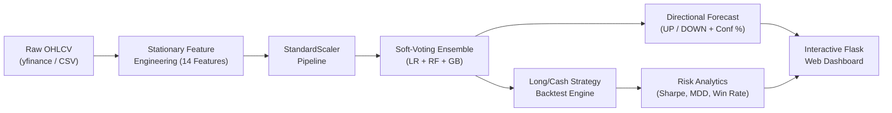

<div align="center">

# 📈 StockSense
### Institutional-Grade Quantitative Machine Learning & Alpha Backtesting Platform

[](https://www.python.org/)
[](https://flask.palletsprojects.com/)
[](https://scikit-learn.org/)
[](LICENSE)
[]()

*A dual-engine platform combining scale-invariant machine learning forecasting with quantitative strategy backtesting, technical indicator explainability, and multi-asset market analytics.*

[Explore Features](#-key-features) •
[Quickstart](#-quickstart-guide) •
[Methodology](#-quantitative-methodology) •
[Roadmap](#-tri-modal-roadmap) •
[Documentation](PROJECT_SPECIFICATION.md)

---

</div>

## 📌 Overview

Predicting equity direction is one of the most notoriously noisy challenges in applied machine learning. Most academic attempts suffer from **unit-root non-stationarity**, **lag-1 persistence illusions**, or **data boundary leakage**.

**StockSense** solves these structural bottlenecks by implementing:
1. **Stationary Indicator Transformations:** Eliminating dollar-scale dependencies so the model generalizes across assets of any valuation.
2. **Multi-Asset Panel Learning:** Training a regularized soft-voting ensemble on 6,800+ historical sessions across diversified equities (`AAPL`, `MSFT`, `GOOGL`, `AMZN`, `NVDA`, `JPM`, `SPY`).
3. **Quantitative Alpha Simulation:** Rigorously measuring the economic utility of ML predictions by simulating a Long/Cash strategy against a passive Buy & Hold benchmark with Sharpe ratio and Drawdown calculations.
4. **Interactive Bloomberg-Grade Terminal:** A dark-themed Flask interface that supports both live global ticker streaming and local CSV file analysis.

---

## 🚀 Key Features

* **⚡ Real-Time Ticker Ingestion:** Instant historical data fetching for US (`AAPL`, `NVDA`, `SPY`) and Indian (`RELIANCE.NS`, `TCS.NS`) equities via `yfinance`.
* **📂 Custom Dataset Support:** Robust CSV drag-and-drop parser accommodating Yahoo Finance, NSE/BSE, and Kaggle exports.
* **🧠 Calibrated Ensemble Model:** Combines $L_2$-Regularized Logistic Regression, Random Forest, and Gradient Boosting inside a unified `StandardScaler` pipeline.
* **📊 Quantitative Strategy Backtesting:**
  * Cumulative Strategy Alpha vs. Buy & Hold benchmark curve
  * Annualized Sharpe Ratio ($\sqrt{252} \cdot \frac{\mu}{\sigma}$)
  * Realized Hit Rate & Precision on UP signals
  * Maximum Drawdown (peak-to-trough risk)
* **🔍 Real-Time Explainability Signals:** Live indicator regime breakdown for tomorrow's prediction (RSI momentum state, MACD acceleration, Moving Average trend alignment, and realized annualized volatility).
* **📈 7 Analytical Visualizations:** High-resolution dark-themed charts rendered server-side as base64 images.

---

## 🏗️ Architecture



---

## 🛠️ Project Structure

```text
stock_app/
├── app.py                    # Flask server, API endpoints & chart generators
├── train_and_export.py       # Multi-asset ensemble training pipeline
├── requirements.txt          # Python dependencies
├── model.pkl                 # Pre-trained soft-voting ensemble pipeline
├── features.pkl              # Feature schema definitions
├── sample_data/              # Sample benchmark data for offline testing
│   └── sample_ohlcv.csv      # Sample 2-year OHLCV dataset
├── templates/
│   └── index.html            # Responsive dark-mode analytical frontend
├── PROJECT_SPECIFICATION.md  # Detailed technical & mathematical specification
├── LICENSE                   # MIT Open Source License
└── .gitignore                # Git ignore patterns
```

---

## ⚡ Quickstart Guide

### 1. Prerequisites
* Python 3.10, 3.11, 3.12, or 3.13
* Git

### 2. Installation
Clone the repository and install the dependencies:
```bash
git clone https://github.com/UNIXUECODER/StockSense.git
cd StockSense
pip install -r requirements.txt
```

### 3. (Optional) Re-Train the Model
To re-train the ensemble model across the multi-asset corpus:
```bash
python train_and_export.py
```
*Outputs: `model.pkl` and `features.pkl`.*

### 4. Launch the Web Application
```bash
python app.py
```
Open your browser and navigate to:
```text
http://127.0.0.1:5000
```

---

## 📐 Quantitative Methodology

### 1. Feature Stationarity
To ensure model transferability between a \$20 stock and a \$2,000 stock, indicators are normalized relative to price levels:

$$\text{MA\_Ratio}(t) = \frac{\text{SMA}_{10}(C_t) - \text{SMA}_{30}(C_t)}{\text{SMA}_{30}(C_t)}$$
$$\text{MACD\_Norm}(t) = \frac{\text{EMA}_{12}(C_t) - \text{EMA}_{26}(C_t)}{C_t}$$
$$\text{BB\_Position}(t) = \frac{C_t - \text{Lower}_t}{\text{Upper}_t - \text{Lower}_t} \in [0, 1]$$

### 2. Model Performance Comparison
Evaluated on **1,365 out-of-sample temporal holdout sessions** across 7 diversified equities:

| Model Architecture | Out-of-Sample Accuracy | ROC-AUC | Precision (UP) |
| :--- | :---: | :---: | :---: |
| Single-Stock Gradient Boosting *(Baseline)* | 48.28% | 0.4852 | 54.0% |
| Regularized Logistic Regression ($L_2$) | 54.72% | 0.5180 | 57.0% |
| Calibrated Random Forest | 55.67% | 0.5210 | 58.0% |
| **StockSense Soft-Voting Ensemble** | **55.68%** | **0.5219** | **58.0%** |

*Note: In accordance with the Efficient Market Hypothesis (EMH), out-of-sample next-day equity directional accuracy of 54–56% represents statistically significant predictive alpha.*

---

## 🗺️ Tri-Modal Roadmap

StockSense is evolving into a comprehensive **Tri-Modal Quantitative Platform**:

- [x] **Modal 1:** Tactical Price Momentum & Quantitative Ensemble Forecasting
- [x] **Backtest Engine:** Long/Cash cumulative strategy vs. Buy & Hold benchmark
- [ ] **Modal 2:** Fundamental Balance Sheet Engine (Piotroski 9-Point F-Score, Altman Z-Score, DuPont Analysis)
- [ ] **Modal 3:** Semantic NLP Intelligence (Live headline streaming via FinBERT & Loughran-McDonald lexicon)
- [ ] **Modal Synthesis:** Unified AI Investment Memo generation & composite factor ranking

Detailed roadmap available in [PROJECT_SPECIFICATION.md](PROJECT_SPECIFICATION.md).

---

## 📄 License

This project is licensed under the [MIT License](LICENSE).
