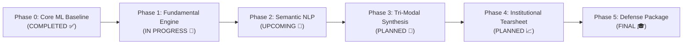

# 🗺️ StockSense: Strategic Development Roadmap
### Evolving into a Tri-Modal Quantitative Investment Platform

---

## 🎯 Vision & Objective

The objective of this roadmap is to systematically transform **StockSense** from a tactical price prediction tool into a **publication-grade, institutional-level Tri-Modal Quantitative Investment Platform**.

By combining **Microstructure Technicals (Price & Volume)**, **Corporate Accounting Fundamentals (Balance Sheets & Solvency)**, and **Semantic Natural Language Processing (News & Sentiment)**, StockSense provides an end-to-end quantitative framework for equity evaluation, strategy simulation, and risk management.

---

## 📊 System Evolution Overview

---

## 📍 Phase Breakdown & Sprint Milestones

### Phase 0: Core Machine Learning & Web Baseline ✅ `[COMPLETED]`
* [x] **Stationary Feature Transformations:** 14 scale-invariant indicators (RSI, normalized MACD, Bollinger position, moving average ratios).
* [x] **Multi-Asset Panel Training:** 6,800+ trading sessions across 7 diversified equities (`AAPL`, `MSFT`, `GOOGL`, `AMZN`, `NVDA`, `JPM`, `SPY`).
* [x] **Soft-Voting Ensemble Pipeline:** Unified `StandardScaler` combining Logistic Regression ($L_2$), Random Forest, and Gradient Boosting.
* [x] **Out-of-Sample Validation:** Lifted out-of-sample directional accuracy from 48.28% to **55.68%** with positive ROC-AUC.
* [x] **Quantitative Alpha Backtest:** Long/Cash cumulative return simulation against Buy & Hold benchmark with Sharpe ratio and Drawdown.
* [x] **Full-Stack Deployment:** Flask web server with dual-input capabilities (live ticker streaming via `yfinance` + custom CSV drag-and-drop).
* [x] **GitHub Repository Launch:** Production repository initialized, documented, and pushed to `origin/main`.

---

### Phase 1: Fundamental Accounting & Solvency Intelligence 🎯 `[IN PROGRESS]`
*Goal: Extract corporate financial statements to evaluate intrinsic quality, financial strength, and bankruptcy distress.*

* [ ] **Module `fundamentals.py`:**
  * [ ] Ingestion pipeline for Balance Sheets, Income Statements, and Cash Flow statements via `yfinance.Ticker`.
  * [ ] Safe handling for financial sector accounting differences (commercial banks vs. industrial firms).
* [ ] **Piotroski 9-Point F-Score Engine:**
  * [ ] Profitability tests: Net Income, Operating Cash Flow, ROA trend, Accruals quality.
  * [ ] Leverage & Liquidity tests: Long-term debt reduction, Current Ratio expansion, share dilution check.
  * [ ] Operating Efficiency tests: Gross Margin expansion, Asset Turnover acceleration.
  * [ ] Discrete score generation ($0$ to $9$) with classification (Strong Value, Stable, Distressed).
* [ ] **Altman Z-Score Credit Distress Model:**
  * [ ] Working Capital, Retained Earnings, EBIT, Market Cap / Debt, and Asset Turnover weighting.
  * [ ] Regime categorization: **Safe Zone** ($>2.99$), **Grey Zone** ($1.81 - 2.99$), **Distress Zone** ($<1.81$).
* [ ] **DuPont 3-Way ROE Decomposition:**
  * [ ] Dissection into Net Profit Margin $\times$ Asset Turnover $\times$ Financial Leverage.
* [ ] **Solvency & Liquidity Radar:**
  * [ ] Current Ratio, Quick Ratio, Debt-to-Equity, Interest Coverage Ratio, Free Cash Flow Yield.
* [ ] **Dashboard Integration (`templates/index.html`):**
  * [ ] Dedicated **"Fundamental Health & Solvency"** tab.
  * [ ] Visual score gauges, solvency warning badges, and balance sheet asset/liability comparative charts.

---

### Phase 2: Semantic NLP & Market Sentiment Intelligence 📰 `[UPCOMING]`
*Goal: Harvest unstructured financial text to gauge market psychology and narrative sentiment.*

* [ ] **Module `sentiment.py`:**
  * [ ] Real-time news ingestion pipeline for searched tickers (Yahoo Finance News / Google News RSS feeds).
  * [ ] Text normalization, financial entity parsing, and headline deduplication.
* [ ] **FinBERT Transformer Classification:**
  * [ ] Integration of domain-specific `ProsusAI/finbert` model via Hugging Face `transformers` / ONNX runtime.
  * [ ] Probability distribution output across $\{\text{Positive}, \text{Neutral}, \text{Negative}\}$.
* [ ] **Loughran-McDonald Financial Lexicon Scoring:**
  * [ ] Extraction of specialized business sentiment dimensions: Uncertainty, Litigious, and Constraining tone scores.
* [ ] **Market Mood Aggregator:**
  * [ ] Time-weighted composite news sentiment index scaled between $-1.0$ (Extreme Fear) and $+1.0$ (Extreme Greed).
* [ ] **Dashboard Integration:**
  * [ ] Dedicated **"News & Sentiment Radar"** tab.
  * [ ] Live headline feed with color-coded sentiment pills and source link redirection.

---

### Phase 3: Tri-Modal Synthesis & AI Investment Thesis 🧠 `[PLANNED]`
*Goal: Synthesize Technicals + Fundamentals + Semantics into a unified executive conviction score.*

* [ ] **Module `synthesis.py`:**
  * [ ] Weighted multi-factor aggregation algorithm:
    $$\text{Composite Score} = w_1 \cdot \text{Technical} + w_2 \cdot \text{Fundamental} + w_3 \cdot \text{Sentiment}$$
  * [ ] Adaptive weighting based on volatility regimes (e.g., higher technical weight in high volatility; higher fundamental weight in calm markets).
* [ ] **Institutional Recommendation Matrix:**
  * [ ] Categorical ratings: `Strong Buy`, `Accumulate / Buy`, `Neutral / Hold`, `Underperform`, `Avoid / Reduce`.
* [ ] **AI-Generated Investment Memo:**
  * [ ] Dynamic thesis generation summarizing technical momentum, balance sheet safety buffers, and headline news catalysts into an executive summary.

---

### Phase 4: Institutional Risk & Backtest Tearsheet 📈 `[PLANNED]`
*Goal: Deliver institutional-grade quantitative backtesting with realistic market execution frictions.*

* [ ] **Module `backtest.py`:**
  * [ ] Multi-regime backtesting (Bull, Bear, and Sideways chop performance).
  * [ ] Implementation of execution friction: transaction costs ($5 \text{ bps}$) and slippage modeling.
* [ ] **Advanced Risk Metrics:**
  * [ ] Annualized Sortino Ratio (downside volatility penalization).
  * [ ] Calmar Ratio (Annualized Return / Maximum Drawdown).
  * [ ] Profit Factor ($\frac{\text{Gross Profits}}{\text{Gross Losses}}$).
* [ ] **Visual Analytics:**
  * [ ] Rolling 30-day Sharpe ratio progression curve.
  * [ ] Underwater drawdown distribution chart.
  * [ ] Monthly returns heatmap grid.

---

### Phase 5: Academic Capstone & Viva Defense Package 🎓 `[FINAL]`
*Goal: Package the system for academic presentation, peer review, and examination defense.*

* [ ] **Formal Research Paper Draft:**
  * [ ] Structure following IEEE / Springer Computer Science & Financial Engineering templates.
  * [ ] Comprehensive literature review (Fama's EMH, Piotroski 2000, FinBERT Araci 2019, Gu et al. 2020).
* [ ] **Viva Defense Presentation Kit:**
  * [ ] Slide deck outline with architectural diagrams and model comparison charts.
  * [ ] Interactive Live Demo script highlighting live ticker analysis and offline CSV grading.
  * [ ] Prepared Q&A matrix addressing model limitations, look-ahead bias, and stationarity.

---

## 🛠️ Technology Stack Matrix

| Domain | Technology / Library | Role in StockSense |
| :--- | :--- | :--- |
| **Backend & Web API** | Python 3.10+, Flask, Jinja2 | RESTful routing, data handling, and template rendering |
| **Machine Learning** | `scikit-learn`, `joblib`, `numpy` | Pipelines, ensemble modeling, preprocessing, and serialization |
| **Data Ingestion** | `yfinance`, `requests`, `pandas` | Market OHLCV streaming, financial statement scraping |
| **Data Visualization** | `matplotlib`, `seaborn` | Base64 high-resolution dark-mode analytical charts |
| **Natural Language Processing** | `transformers`, `torch` / `onnx` | FinBERT financial sentiment classification |
| **Lexical Analytics** | Loughran-McDonald Lexicon | Domain-specific accounting sentiment and uncertainty scoring |
| **Frontend Interface** | HTML5, CSS3 Grid/Flexbox, JavaScript | Modern, dark-themed responsive dashboard interface |
| **Version Control** | Git, GitHub | Source control, collaborative tracking, and open-source release |

---

## 📌 Contribution & Tracking Workflow

* Every milestone corresponds to a feature branch (`feat/fundamentals`, `feat/sentiment`, etc.).
* Automated py-compile checks and unit tests before merging to `main`.
* GitHub issues and project board to track sprint velocity.
